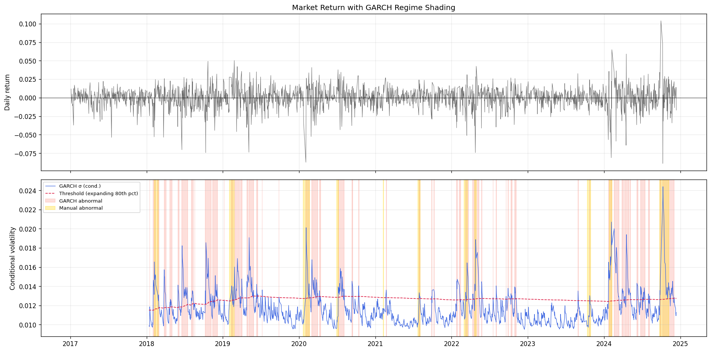
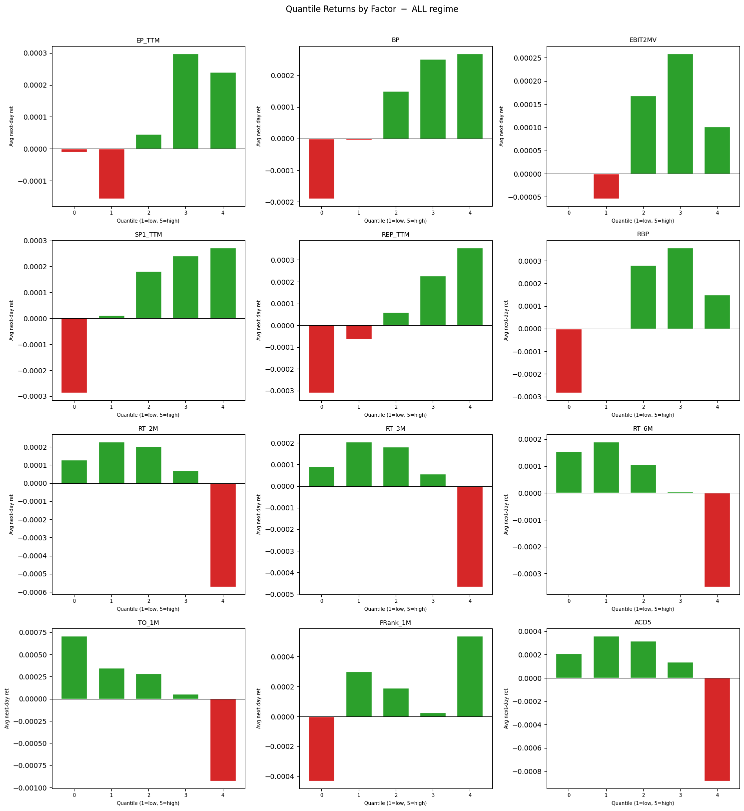
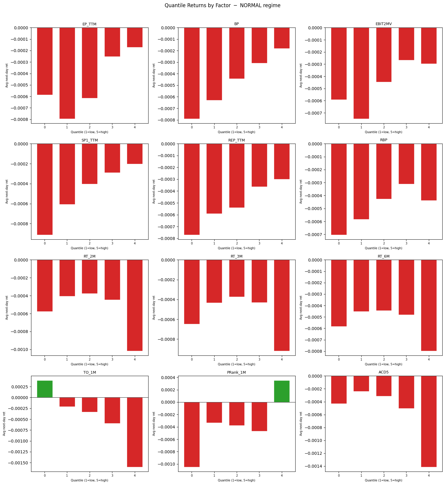
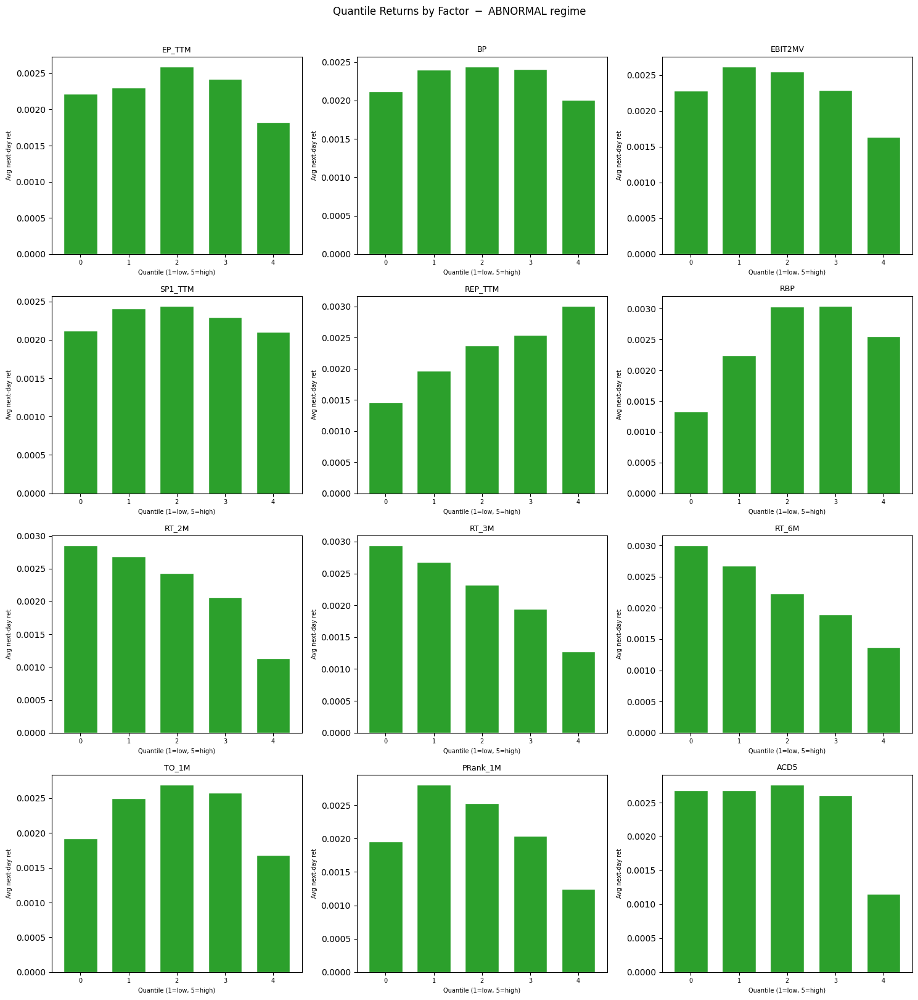
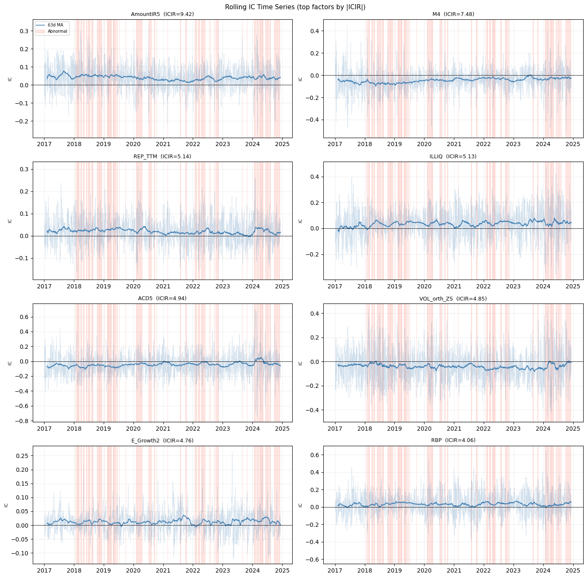
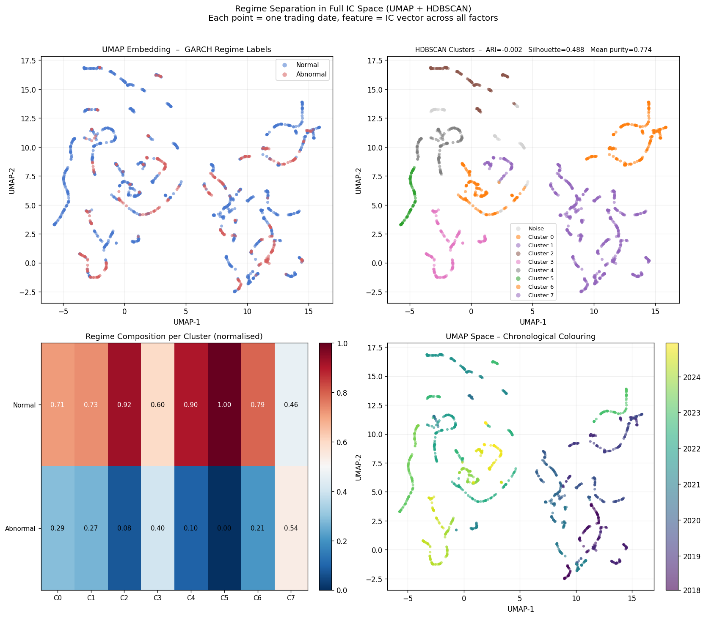
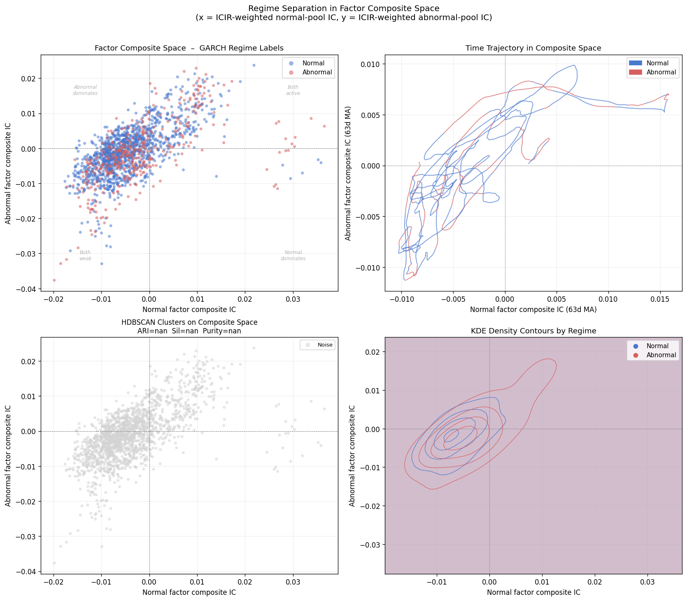
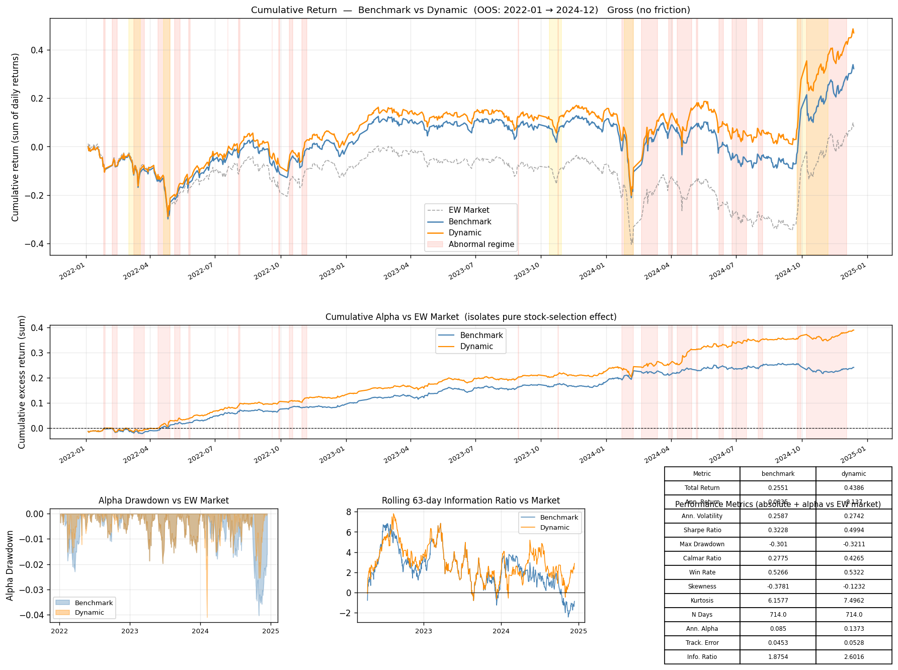
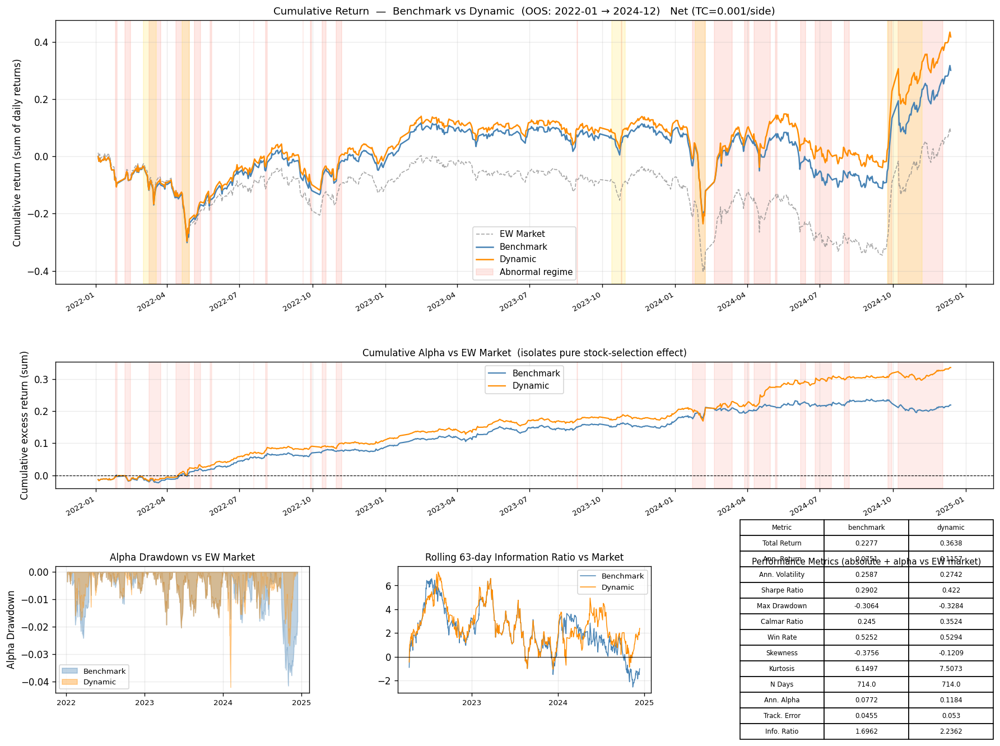

# Abnormal Regime Analysis

This directory contains a full end-to-end pipeline for:

1. detecting abnormal market regimes from aggregate market volatility,
2. measuring how factor efficacy changes across normal vs abnormal periods,
3. constructing a benchmark sleeve and a regime-adaptive dynamic sleeve, and
4. backtesting whether the dynamic sleeve adds value when market conditions deteriorate.

The current version includes three important implementation fixes:

- factor pools are selected on the training sample only,
- ICIR weights are fit once on the full training sample and frozen in test,
- the dynamic portfolio switches immediately on regime flips and uses the benchmark sleeve on normal regimes by construction for next-day holdings.

## Executive Summary

The final investment result is positive: the dynamic strategy outperforms the benchmark in the saved out-of-sample run, with the improvement concentrated in abnormal regimes.

- Net total return improves from `22.77%` to `36.38%` (`+13.61pp`).
- Net annualized return improves from `7.51%` to `11.57%` (`+4.06pp`).
- Net annualized alpha improves from `7.72%` to `11.84%` (`+4.12pp`).
- Net Information Ratio improves from `1.6962` to `2.2362`.
- Gross total return improves from `25.51%` to `43.86%` (`+18.35pp`).

The logic behind the improvement is coherent:

- the benchmark sleeve keeps the strongest broad factors across all periods,
- the dynamic sleeve only changes when the market enters an abnormal regime,
- the abnormal sleeve is not rebuilt from scratch; it starts from the benchmark sleeve and only swaps in factors that are stronger in the abnormal training sample.

## Pipeline Overview

| Stage | Module | Purpose | Main Output |
| --- | --- | --- | --- |
| 1 | `data_loader.py` | Load daily stock panel, factor files, and returns | factor panel in memory |
| 2 | `garch_regime.py` | Fit GARCH on equal-weighted market return and label abnormal days | [`regime_labels.csv`](outputs/results/regime_labels.csv) |
| 3 | `factor_analysis.py` | Compute daily IC, ICIR, t-stats, and quantile sorts | [`factor_ic_report.csv`](outputs/results/factor_ic_report.csv) |
| 4 | `regime_portfolio.py` | Build benchmark and dynamic sleeves from train-only summaries | [`factor_classification.csv`](outputs/results/factor_classification.csv) |
| 5 | `regime_clustering.py` | Visualize regime structure in factor space | [`regime_cluster_summary.csv`](outputs/results/regime_cluster_summary.csv) |
| 6 | `icir_predictor.py` | Freeze train ICIR weights and run benchmark vs dynamic backtest | [`backtest_metrics_net.csv`](outputs/results/backtest_metrics_net.csv) |

## Core Heuristics

- Regime detection uses an expanding-window threshold to avoid look-ahead bias.
- The abnormal threshold is tightened to `0.80`, making the switch more selective.
- Factor efficacy is measured with daily cross-sectional Spearman IC and annualized ICIR.
- Pool construction is train-only through `2021-12-31`.
- The benchmark sleeve uses top factors by `|ICIR_all|`.
- The dynamic abnormal sleeve begins with the benchmark sleeve and only replaces the weakest abnormal members with factors that are strictly stronger in train abnormal `|ICIR|`.
- Trading uses signal date `t` and holds from `t+1` onward, removing the prior same-day timing bug.
- The dynamic sleeve rebalances on the monthly schedule plus any regime flip inside the holding window.

## Data Split

- Training sample: `2017-01-01` to `2021-12-31`
- Test sample: `2022-01-01` to `2024-12-31`
- Benchmark rebalance frequency: every `21` trading days
- Dynamic rebalance frequency: every `21` trading days plus any regime flip
- Portfolio construction: top `20%` of stocks by ICIR composite score
- Transaction cost: `10 bps` one-way

## 1. Regime Detection

The regime model fits GARCH on the equal-weighted market return, then labels a day abnormal if conditional volatility exceeds the expanding `80th` percentile threshold.

### GARCH Order Search

| p | q | AIC | BIC | LB_lag5_p | LB_lag10_p | LB_lag15_p | clean_resid |
| --- | --- | --- | --- | --- | --- | --- | --- |
| 1 | 1 | 4098.46 | 4118.87 | 0.0239 | 0.0353 | 0.059 | False |
| 2 | 1 | 4100.46 | 4125.98 | 0.0239 | 0.0353 | 0.059 | False |
| 3 | 1 | 4102.46 | 4133.08 | 0.0239 | 0.0353 | 0.059 | False |
| 4 | 1 | 4104.46 | 4140.18 | 0.0239 | 0.0353 | 0.059 | False |

No candidate fully passes the Ljung-Box residual test, so the pipeline falls back to the lowest-AIC choice, `GARCH(1,1)`.

### GARCH vs Manual Abnormal Intervals

| GARCH_abnormal_days | Manual_abnormal_days | Overlap_days | False_positive_days | False_negative_days | Precision | Recall | F1 |
| --- | --- | --- | --- | --- | --- | --- | --- |
| 397.0 | 130.0 | 88.0 | 309.0 | 42.0 | 0.2217 | 0.6769 | 0.334 |

Interpretation:

- recall is reasonably high, so the detector captures most manually identified abnormal episodes,
- precision remains modest, which is typical for a volatility-only regime classifier,
- tightening the threshold to `0.80` reduced over-triggering versus the looser earlier configuration.

### Plots



Supporting files:

- [`garch_order_selection.csv`](outputs/results/garch_order_selection.csv)
- [`garch_vs_manual.csv`](outputs/results/garch_vs_manual.csv)
- [`regime_labels.csv`](outputs/results/regime_labels.csv)

## 2. Factor Analysis

The factor layer evaluates how predictive each signal is in cross-section. The main statistics are:

- `IC_mean`: mean daily Spearman IC,
- `ICIR`: annualized `IC_mean / IC_std`,
- `t_stat`: significance of mean IC,
- regime sensitivity: `ICIR_abnormal - ICIR_normal`.

### Representative Factor Sensitivity Table

| Factor | ICIR_all | ICIR_normal | ICIR_abnormal | regime_sensitivity |
| --- | --- | --- | --- | --- |
| ILLIQ | 4.7874 | 4.0679 | 8.1286 | 4.0607 |
| VOL_orth_ZS | -4.5905 | -5.3464 | -2.3759 | 2.9705 |
| TO_1M | -3.6462 | -4.2651 | -1.4045 | 2.8606 |
| Beta_orth_ZS | 1.0716 | 0.6349 | 2.7241 | 2.0892 |
| GrossIncomeRatioTTM | 1.0115 | 0.668 | 2.5397 | 1.8717 |
| BCVP | -5.6385 | -6.0354 | -4.1738 | 1.8616 |
| CCI5 | -3.8964 | -4.2392 | -2.6902 | 1.549 |
| RBP | 3.9343 | 3.6583 | 5.0869 | 1.4286 |
| OR_Growth2 | 4.3348 | 4.0971 | 5.4731 | 1.376 |
| REP_TTM | 5.9357 | 5.6715 | 7.0215 | 1.35 |
| ROATTM | 1.8472 | 1.6554 | 2.6792 | 1.0238 |
| ACD5 | -6.3733 | -6.3833 | -6.4184 | -0.0351 |

Interpretation:

- `ILLIQ`, `REP_TTM`, `OR_Growth2`, and `RBP` remain strong during stress.
- `RT_2M` and `RT_3M` become meaningfully stronger in abnormal periods than some weaker benchmark members.
- `ACD5` and `AmountIR5` are strong across both regimes, so they stay in both sleeves.

### Factor Distribution and Stability Plots









Supporting files:

- [`factor_ic_report.csv`](outputs/results/factor_ic_report.csv)
- [`factor_classification.csv`](outputs/results/factor_classification.csv)
- [`ic_all_series.csv`](outputs/results/ic_all_series.csv)
- [`ic_normal_series.csv`](outputs/results/ic_normal_series.csv)
- [`ic_abnormal_series.csv`](outputs/results/ic_abnormal_series.csv)
- [`fmb_tstats.csv`](outputs/results/fmb_tstats.csv)

## 3. Regime Clustering

The clustering stage is a descriptive diagnostic rather than a trading engine. It tests whether factor behavior itself separates into distinguishable market states.

### Cluster Summary

| view | n_clusters | noise_fraction | ARI | Silhouette | Mean_purity |
| --- | --- | --- | --- | --- | --- |
| Composite-2D | 0 | 1.0 |  |  |  |
| UMAP + HDBSCAN | 8 | 0.067 | -0.0016 | 0.4878 | 0.774 |

Interpretation:

- the hand-built 2D composite view does not cluster cleanly,
- the `UMAP + HDBSCAN` view finds `8` clusters with low noise and decent purity,
- this supports the idea that factor behavior changes materially across environments, even if the clusters do not line up perfectly with the binary GARCH regime labels.

### Plots





Supporting files:

- [`regime_cluster_summary.csv`](outputs/results/regime_cluster_summary.csv)
- [`regime_composites.csv`](outputs/results/regime_composites.csv)

## 4. Portfolio Construction

The investment layer uses two sleeves:

- **Benchmark sleeve**: stable high-conviction factors ranked by train `|ICIR_all|`.
- **Dynamic abnormal sleeve**: starts from the benchmark sleeve and only swaps in factors that are stronger in train abnormal `|ICIR|`.

This makes the dynamic strategy conservative: it is a targeted abnormal overlay, not a complete style rotation.

### Sleeve Comparison

| Benchmark sleeve | Dynamic abnormal sleeve | Benchmark ICIR_all | Dynamic abnormal ICIR_abnormal |
| --- | --- | --- | --- |
| AmountIR5 | AmountIR5 | 9.4867 | 8.752 |
| M4 | M4 | -8.9497 | -10.5807 |
| ACD5 | ACD5 | -6.3733 | -6.4184 |
| REP_TTM | REP_TTM | 5.9357 | 7.0215 |
| BCVP | BCVP | -5.6385 | -4.1738 |
| E_Growth2 | E_Growth2 | 5.0639 | 4.3674 |
| ILLIQ | ILLIQ | 4.7874 | 8.1286 |
| VOL_orth_ZS | RT_2M | -4.5905 | -6.0373 |
| StyleBias20 | StyleBias20 | -4.4147 | -6.4684 |
| OR_Growth2 | OR_Growth2 | 4.3348 | 5.4731 |
| RBP | RBP | 3.9343 | 5.0869 |
| CCI5 | RT_3M | -3.8964 | -5.2004 |

Abnormal-period replacements:

- `VOL_orth_ZS -> RT_2M`
- `CCI5 -> RT_3M`

This is a controlled tilt toward factors that are stronger in stress, while preserving the rest of the benchmark structure.

## 5. Investment Results

### Net Performance

| Metric | benchmark | dynamic |
| --- | --- | --- |
| Total Return | 0.2277 | 0.3638 |
| Ann. Return | 0.0751 | 0.1157 |
| Ann. Volatility | 0.2587 | 0.2742 |
| Sharpe Ratio | 0.2902 | 0.422 |
| Max Drawdown | -0.3064 | -0.3284 |
| Calmar Ratio | 0.245 | 0.3524 |
| Win Rate | 0.5252 | 0.5294 |
| Skewness | -0.3756 | -0.1209 |
| Kurtosis | 6.1497 | 7.5073 |
| N Days | 714.0 | 714.0 |
| Ann. Alpha | 0.0772 | 0.1184 |
| Track. Error | 0.0455 | 0.053 |
| Info. Ratio | 1.6962 | 2.2362 |

### Gross Performance

| Metric | benchmark | dynamic |
| --- | --- | --- |
| Total Return | 0.2551 | 0.4386 |
| Ann. Return | 0.0835 | 0.137 |
| Ann. Volatility | 0.2587 | 0.2742 |
| Sharpe Ratio | 0.3228 | 0.4994 |
| Max Drawdown | -0.301 | -0.3211 |
| Calmar Ratio | 0.2775 | 0.4265 |
| Win Rate | 0.5266 | 0.5322 |
| Skewness | -0.3781 | -0.1232 |
| Kurtosis | 6.1577 | 7.4962 |
| N Days | 714.0 | 714.0 |
| Ann. Alpha | 0.085 | 0.1373 |
| Track. Error | 0.0453 | 0.0528 |
| Info. Ratio | 1.8754 | 2.6016 |

### Where the Improvement Comes From

| Segment | Days | Benchmark total return | Dynamic total return | Dynamic - Benchmark (sum of daily excess) | Share of days dynamic > benchmark |
| --- | --- | --- | --- | --- | --- |
| All OOS | 714 | 0.2277 | 0.3638 | 0.1167 | 0.1373 |
| Normal regime | 543 | -0.4418 | -0.4482 | -0.0108 | 0.0295 |
| Abnormal regime | 171 | 1.1993 | 1.4716 | 0.1275 | 0.4795 |

Interpretation:

- the dynamic edge is overwhelmingly earned during abnormal periods,
- the normal-regime difference is small and slightly negative in aggregate,
- the abnormal-regime gain more than offsets that drift, which is exactly the intended behavior of the overlay.

The low share of days with dynamic beating benchmark is not a contradiction. It means the dynamic advantage comes from fewer, larger abnormal-regime wins rather than small day-by-day improvements.

### Backtest Plots





Supporting files:

- [`backtest_metrics_gross.csv`](outputs/results/backtest_metrics_gross.csv)
- [`backtest_metrics_net.csv`](outputs/results/backtest_metrics_net.csv)
- [`backtest_gross_returns.csv`](outputs/results/backtest_gross_returns.csv)
- [`backtest_net_returns.csv`](outputs/results/backtest_net_returns.csv)
- [`backtest_daily_returns.csv`](outputs/results/backtest_daily_returns.csv)

## Reproduction

Run the full pipeline from this directory:

```bash
python run_pipeline.py
```

Main modules:

- [`run_pipeline.py`](run_pipeline.py)
- [`garch_regime.py`](garch_regime.py)
- [`factor_analysis.py`](factor_analysis.py)
- [`regime_portfolio.py`](regime_portfolio.py)
- [`icir_predictor.py`](icir_predictor.py)

## Final Takeaway

The current pipeline supports the original thesis:

- factor efficacy changes materially across market regimes,
- a train-only abnormal sleeve can be built without throwing away the benchmark structure,
- switching into that sleeve during abnormal periods improves both total return and excess return in the current out-of-sample run.

The cleanest statement of the result is:

- **Benchmark net annual alpha:** `7.72%`
- **Dynamic net annual alpha:** `11.84%`
- **Dynamic improvement:** `+4.12pp`

That is the most direct evidence that the regime-aware abnormal sleeve is adding value beyond the baseline benchmark sleeve.
